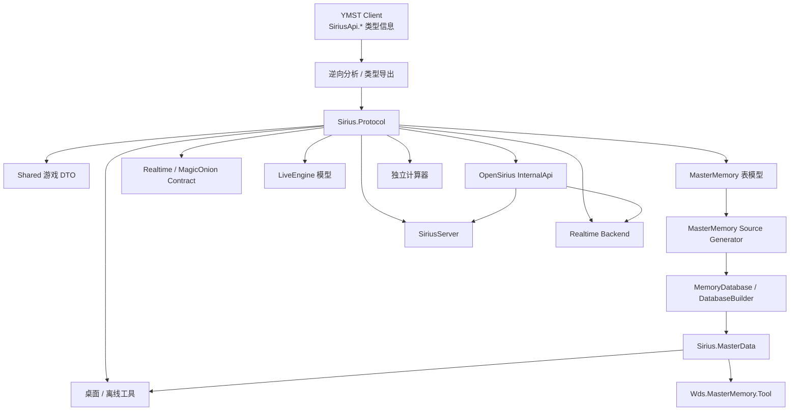

# SiriusData

<p align="center">
  <strong>World Dai Star: Yume no Stellarium（YMST / ユメステ）共享协议与数据基础设施</strong>
</p>

<p align="center">
  客户端逆向协议模型 · MasterMemory 数据结构与工具链 · MagicOnion Realtime 契约 · OpenSirius 内部服务契约
</p>

<p align="center">
  <a href="./README.md">English</a> ·
  <a href="./README-CN.md"><strong>简体中文</strong></a>
</p>

<p align="center">
  <a href="https://github.com/TeamOpenSirius/SiriusData/actions/workflows/dotnet.yml"></a>
  
  
  
  
</p>

---

## 项目简介

**SiriusData** 是 TeamOpenSirius 围绕 **World Dai Star: Yume no Stellarium（YMST / ユメステ）** 使用的共享协议与数据模型基础设施。

它的主要作用，是让游戏服务端、Realtime 服务、桌面工具、计算器以及其他相关项目共享同一套数据结构，而不是在各个仓库中分别维护互不兼容的协议副本。

`Sirius.Protocol` 中的大部分游戏侧模型来源于对客户端的逆向分析：从客户端 **`SiriusApi.*`** 相关类型信息中导出并恢复结构，再经过整理和改造，使其能够作为正常的 .NET 共享库使用，并兼容 MessagePack、MasterMemory、MagicOnion 以及 OpenSirius 的服务端实现。

除此之外，仓库还包含一部分 **TeamOpenSirius 自有协议**。这些类型位于 `Sirius.Protocol.InternalApi`，用于 OpenSirius 内部服务之间通信，例如游戏服务端、账号平台和 Realtime 后端。它们属于 OpenSirius 私有基础设施协议，**不是客户端原始 API 的一部分**。

`PlatformScoreRecordMutationContracts.cs` 定义 SiriusServer 补录正常结算成绩、
清空指定谱面打歌记录的请求与响应类型。

简单来说，SiriusData 是以下模块之间的公共数据边界：

- 从 YMST 客户端恢复出的协议与数据结构；
- 游戏服务端对这些协议的实现；
- MagicOnion Realtime 网络通信；
- MasterMemory 主数据访问与编辑；
- OpenSirius 服务间通信；
- 桌面工具、离线工具以及独立计算器。

## 设计目标

SiriusData 遵循几个核心原则：

- **协议模型只维护一份**，避免 Server / Tool 各自复制。
- **优先保证 Wire Compatibility**，序列化结构、Union ID、字段顺序和类型身份不能随意修改。
- 客户端逆向得到的协议与 **OpenSirius 自有协议明确区分**。
- MasterMemory 使用官方 Source Generator 管线，不维护伪兼容层。
- 对逆向中暂时无法确认含义的字段，**宁可保留未知状态，也不编造语义**。
- `Sirius.Protocol` 保持为可独立引用的底层依赖，不反向依赖具体服务端实现。

## 仓库组成

| 项目 | 作用 |
| --- | --- |
| `Sirius.Protocol` | YMST 共享协议 DTO、枚举、MessagePack 模型、MasterMemory 表模型、Realtime 契约以及 OpenSirius InternalApi |
| `Sirius.MasterData` | 类型化 MasterMemory 查看、修改、导出、重建与校验库 |
| `Wds.MasterMemory.Tool` | `mastermemory.db` 离线解包、编辑、翻译、重打包和校验 CLI |

### `Sirius.Protocol`

`Sirius.Protocol` 是整个仓库的核心程序集。

它包含 HTTP/API Payload、玩家状态、MasterData、Live 逻辑、Realtime 网络以及大量游戏系统共用的数据结构。

目标框架：

```text
net10.0
```

直接依赖保持得比较精简：

- `MessagePack` 3.1.8
- `MessagePackAnalyzer` 3.1.8
- `MasterMemory` 3.0.4
- `MagicOnion.Abstractions` 6.1.7

### `Sirius.MasterData`

`Sirius.MasterData` 基于 `Sirius.Protocol` 中的 MasterMemory 模型，提供更高层的类型化数据库操作。

目前主要负责：

- MasterMemory 数据库校验；
- 枚举数据库中的表；
- 查看表记录；
- 类型化新增 / 修改数据；
- JSON 导出；
- 从 JSON 重建数据库；
- 无修改情况下的 byte-exact round-trip 校验。

### `Wds.MasterMemory.Tool`

这是面向脚本和离线处理的命令行工具。

典型用途包括：

- 解包 `mastermemory.db`；
- 查看和导出表；
- 将数据导出为可编辑 JSON；
- 提取需要翻译的文本；
- 应用本地化 CSV；
- 重新构建合法的 MasterMemory 数据库；
- 验证模型和数据库是否匹配。

## 数据模型来源

### 客户端逆向协议

仓库中绝大多数游戏侧协议，最初来自客户端 `SiriusApi.*` 相关类型信息的逆向导出。

但当前仓库并不是一份简单的反编译代码 Dump。

这些结构已经经过整理和适配：

- 统一组织到 `Sirius.Protocol.*` 命名空间；
- 保留必要的 MessagePack 序列化契约；
- 为 MasterData 类型补充 MasterMemory 描述；
- 根据实际 `mastermemory.db` 对部分较新的结构进行校正；
- 把兼容修复集中到共享库中，而不是让每个消费项目重复修补。

因此更准确的理解是：

> **SiriusData 提供的是由客户端逆向恢复、再经过工程化整理的 YMST 协议兼容模型。**

它不是官方 SDK，也不是官方源码。

### OpenSirius InternalApi

`Models/InternalApi/` 的性质不同。

这里存放的是 TeamOpenSirius 自己定义的服务间通信结构，目前包括部分：

- Realtime 身份认证；
- 账号 / 平台管理；
- 账号导入与引继；
- 玩家管理；
- Realtime 在线状态；
- Session 撤销；
- Multi Live 会话协调；
- Game Master / 平台接口；
- Photo / 平台接口。

它们用于让不同 OpenSirius 服务通过统一 DTO 通信，而不需要互相引用具体服务端项目。

这些类型**不应被理解为官方客户端 API**。

## 协议结构

### Shared 游戏数据模型

`Models/Shared/` 是整个协议层中规模最大的部分，包含大部分游戏侧共享模型。

覆盖的领域包括：

- 玩家与个人资料；
- 角色与角色养成；
- 队伍；
- 音乐与 Live；
- Poster / Accessory；
- 道具和资产；
- Mission；
- Shop / Currency；
- Event；
- League；
- Photo / Album；
- Gacha；
- Home；
- 社交、屏蔽以及其他共享 Payload / Result。

其中大量类型会参与核心 MessagePack `IDataObject` Union。

### `IDataObject`

`Sirius.Protocol.Shared.IDataObject` 是协议兼容中的关键边界。

它是一个 MessagePack `[Union]` 接口，Union 成员同时覆盖：

- 玩家运行时数据；
- 游戏状态；
- MasterData 表类型；
- Party / Character / Live；
- Event / Shop / League；
- 其他共享对象。

由于 MasterMemory 表模型本身也参与这个 Union，所以它不能简单地从整个协议层拆成完全独立的程序集，否则会破坏依赖关系和类型身份。

这也是完整协议模型继续统一保存在 `Sirius.Protocol` 中的主要原因。

### Realtime

`Models/Realtime/` 保存 Realtime 网络需要的数据结构和抽象。

其中包含 MagicOnion 兼容 Hub Contract，以及 Circle、聊天、Multi Live、通知、在线状态等 Realtime 功能使用的共享模型。

需要 Realtime 通信的服务端、客户端兼容层和相关工具可以直接引用同一份契约。

### LiveEngine

`Models/LiveEngine/` 主要包含 Live / 计分逻辑所需的模型和枚举，例如：

- Effect；
- Trigger；
- Branch Condition；
- Sense Light；
- 其他 Live 计算结构。

### MasterData

MasterMemory 表模型位于：

```text
src/Sirius.Protocol/Models/Shared/Models/Master/
```

当前模型集覆盖 **229 张 MasterMemory 表**。

仓库中签入的是表模型定义，而以下类型由 **Cysharp MasterMemory 3.0.4** 在编译期自动生成：

- `Sirius.Protocol.Shared.MemoryDatabase`
- `Sirius.Protocol.Shared.DatabaseBuilder`
- `Sirius.Protocol.Shared.ImmutableBuilder`
- `Sirius.Protocol.Shared.Tables.*Table`
- MasterMemory MessagePack Resolver

因此不要重新添加手写的 `MemoryDatabase`、`DatabaseBuilder` 或 `*Table` 兼容实现。

## 总体架构



核心原则是：

> **SiriusServer、Realtime 和各种工具依赖 SiriusData，而 SiriusData 不依赖具体服务端实现。**

## 项目结构

```text
SiriusData/
├── .github/
│   └── workflows/
│       └── dotnet.yml
├── SiriusData.sln
└── src/
    ├── Sirius.Protocol/
    │   ├── Common/
    │   ├── Compatibility/
    │   ├── Models/
    │   │   ├── InternalApi/
    │   │   ├── LiveEngine/
    │   │   ├── Realtime/
    │   │   ├── Root/
    │   │   └── Shared/
    │   │       └── Models/
    │   │           └── Master/
    │   ├── MasterMemoryGeneratorOptions.cs
    │   ├── README.MasterMemory.md
    │   └── tools/
    │       └── Wds.MasterMemory.Tool/
    └── Sirius.MasterData/
        ├── IO/
        └── MasterMemory/
```

## 歌曲浏览器 JSON 契约

`src/Sirius.Protocol/Models/InternalApi/PlatformSongExplorerApiContracts.cs` 定义平台
歌曲浏览器的查询、列表、谱面详情、分布、错误和本地历史恢复结果 DTO。它们使用 Web JSON
的 camelCase 命名策略，不实现 `IDataObject`，不改变 MessagePack Union 编号或 MasterMemory 布局。

`PlatformSongExplorerRebuildResult` 与现有受控 `rebuild-local` 返回一致，字段为
`dryRun`、`scanned`、`eligible`、`ineligible`、`skipped`、`nextAfterResultId`、`hasMore`
和 `warnings`。`skipped` 是原因 key 到整数计数的对象，不是总计数或来源枚举。
`nextAfterResultId` 是十进制字符串（尚无结果时可以为 `"0"`），保留 64 位游标 ID 精度。
消费方应使用稳定 key，保留 nullable 与真实零值，并在目录、schema 和成绩版本之外，
保留列表／详情的 `statisticsVersion`、`resourceVersion`、`counterRulesVersion`。

`PlatformSongSummary.CoverUrl` 是 CDN 主封面地址。可选的 `CoverFallbackUrl`
（Web JSON 字段名 `coverFallbackUrl`）提供固定到同一资源版本的 GitHub 地址，供主封面
加载失败时回退使用。省略或传入 null 均有效；旧响应反序列化后该字段为 null，原有位置
构造函数签名保持不变。

运行 `dotnet test tests/Sirius.Protocol.Tests -c Release` 验证 JSON 边界，包括新增回退字段
之前的旧响应兼容性。

2026-10-04 的歌曲浏览器验证中，源码项目与本地 NuGet 包的 11 项契约测试均已通过。
Release MasterMemory 工具对两份真实发布数据均返回 `BYTE-EXACT ROUNDTRIP: PASS`：
两份均为 229 表，分别含 84,822 与 84,877 行。输入／输出的哈希与长度一致，原始输入
保持不变。这验证了解码与无编辑重打包，不代表已验证编辑表后的重建。复跑时将
`SIRIUS_TEST_MASTER_DB` 设置为获准使用的样本路径，在仓库根目录执行：

```powershell
dotnet run --project ./src/Sirius.Protocol/tools/Wds.MasterMemory.Tool -c Release -- `
  roundtrip "$env:SIRIUS_TEST_MASTER_DB" ./artifacts/mastermemory-roundtrip
```

## 构建

### 环境要求

完整构建使用 .NET 10 SDK。

```powershell
dotnet restore .\SiriusData.sln
dotnet build .\SiriusData.sln -c Release
```

主要类库目标：

```text
net10.0
```

MasterMemory 离线工具也使用 .NET 10。

## 在其他项目中引用

TeamOpenSirius 日常开发通常将相关仓库放在同一级目录：

```text
workspace/
├── SiriusData/
├── SiriusServer/
└── SiriusToolbox/
```

开发环境可以直接使用 `ProjectReference`：

```xml
<ItemGroup>
  <ProjectReference Include="..\SiriusData\src\Sirius.Protocol\Sirius.Protocol.csproj" />
</ItemGroup>
```

如果构建环境中没有 SiriusData 源码，也可以将 `Sirius.Protocol` 打包成 NuGet 包后引用。

### 打包

```powershell
dotnet pack .\src\Sirius.Protocol\Sirius.Protocol.csproj `
  -c Release `
  -o .\artifacts\packages
dotnet pack .\src\Sirius.MasterData\Sirius.MasterData.csproj `
  -c Release `
  -o .\artifacts\packages
```

Package ID：

```text
Sirius.Protocol
Sirius.MasterData
```

带有 `v1.2.3` 形式标签的 workflow 会将两个包发布到 GitHub Packages：
`https://nuget.pkg.github.com/TeamOpenSirius/index.json`。消费项目添加该源后，
即可使用 `PackageReference` 引用对应版本。

消费项目可以使用条件 `ProjectReference` / `PackageReference`：

- 开发机优先引用同级最新源码；
- CI / 独立构建环境使用预编译 Package。

### 歌曲浏览器本地联调包

Dashboard 和 Server 当前通过 NuGet 使用滚动包。本地验证尚未发布的歌曲浏览器契约时，
保持这一包引用边界，在本仓库为两个库指定相同且唯一的预发布版本：

```powershell
$packageVersion = '1.0.3-song-explorer.local.1' # 示例；内容变化时换用新版本。
$packageDirectory = Join-Path (Get-Location).Path 'artifacts/packages'
dotnet pack ./src/Sirius.Protocol/Sirius.Protocol.csproj -c Release `
  "-p:PackageVersion=$packageVersion" -o $packageDirectory
dotnet pack ./src/Sirius.MasterData/Sirius.MasterData.csproj -c Release `
  "-p:PackageVersion=$packageVersion" -o $packageDirectory
```

消费方 restore 时设置 `UseSiriusDataRollingPackages=false`，将计算得到的
`$packageDirectory` 加入 `RestoreAdditionalProjectSources`，并将现有
`PackageReference` 固定到 `$packageVersion`。Dashboard 可使用 MSBuild 属性
`SiriusProtocolPackageVersion`；如果消费项目直接写了 `*-*`，还需显式覆盖该引用项的版本。
联调使用隔离的 `RestorePackagesPath`，不要改回兄弟源码 `ProjectReference`。
以上命令只生成本地产物，不发布包或 release。契约再次变化时应换用新的预发布版本，
避免 NuGet 缓存复用旧包。

## MasterMemory 使用

`mastermemory.db` 是 MasterMemory 数据库，不能把整个文件当成普通 MessagePack 根对象直接反序列化。

正确方式是使用 Source Generator 生成的 `MemoryDatabase`：

```csharp
using Sirius.Protocol.Shared;

byte[] bytes = await File.ReadAllBytesAsync("mastermemory.db");

var db = new MemoryDatabase(
    bytes,
    maxDegreeOfParallelism: Environment.ProcessorCount);

var music = db.MusicMasterTable.FindById(1);
```

### 类型化编辑 API

`Sirius.MasterData` 提供更高层的数据库操作：

```csharp
var report = MasterMemoryDatabaseService.Verify(databasePath);

var tables = MasterMemoryDatabaseService.GetTables(databasePath);

var rows = MasterMemoryDatabaseService.ListRecords(
    databasePath,
    tableName,
    offset,
    limit);

await MasterMemoryDatabaseService.ExportAllJsonAsync(
    databasePath,
    jsonDirectory);

var pack = MasterMemoryDatabaseService.PackFromJson(
    sourceDatabase,
    jsonDirectory,
    baselineJsonDirectory,
    outputDatabase,
    requireExact: true);
```

数据库重建时，如果某张表的数据实际上没有变化，会尽量继续使用原始 Payload Block。

这样不仅可以减少不必要的二进制变化，也可以利用严格 round-trip 检查模型是否正确描述了数据库。

## Wds.MasterMemory.Tool

查看帮助：

```powershell
dotnet run --project .\src\Sirius.Protocol\tools\Wds.MasterMemory.Tool -- --help
```

基本解包 / 修改 / 重打包流程：

```powershell
dotnet run --project .\src\Sirius.Protocol\tools\Wds.MasterMemory.Tool -- `
  unpack .\mastermemory.db .\dump

# 修改 dump\tables\*.json

dotnet run --project .\src\Sirius.Protocol\tools\Wds.MasterMemory.Tool -- `
  pack .\dump .\mastermemory_modified.db

dotnet run --project .\src\Sirius.Protocol\tools\Wds.MasterMemory.Tool -- `
  verify .\mastermemory_modified.db
```

无修改严格回包：

```powershell
dotnet run --project .\src\Sirius.Protocol\tools\Wds.MasterMemory.Tool -- `
  roundtrip .\mastermemory.db .\rt
```

翻译流程：

```powershell
dotnet run --project .\src\Sirius.Protocol\tools\Wds.MasterMemory.Tool -- `
  extract-text .\dump .\translation.csv

dotnet run --project .\src\Sirius.Protocol\tools\Wds.MasterMemory.Tool -- `
  apply-text .\dump .\translation.csv
```

更详细说明见：

[`src/Sirius.Protocol/tools/Wds.MasterMemory.Tool/README.md`](./src/Sirius.Protocol/tools/Wds.MasterMemory.Tool/README.md)

## 逆向与 Schema 维护原则

修改客户端逆向模型时，应优先依赖可验证证据，而不是根据名字猜测。

建议遵循：

1. 保留已确认的序列化字段顺序 / MessagePack Key；
2. 保留已确认的 Union ID 与类型身份；
3. 与当前客户端 Metadata、实际请求数据进行比对；
4. MasterMemory 变更需要结合真实数据库验证；
5. 暂时无法确认含义的字段使用 `ReservedXX` 一类保守命名；
6. 没有可靠依据时不要自行添加 Secondary Index 或数据关系。

MasterMemory 模型发生变化后，应执行 round-trip 校验。

## 更新 MasterMemory Schema

修改：

```text
src/Sirius.Protocol/Models/Shared/Models/Master/
```

中的类型后，会直接影响 MasterMemory Source Generator 输出。

建议执行：

```powershell
dotnet build .\SiriusData.sln -c Release

dotnet run --project .\src\Sirius.Protocol\tools\Wds.MasterMemory.Tool -- `
  roundtrip .\mastermemory.db .\rt
```

如果一个没有进行任何修改的数据库能够做到 byte-exact round trip，通常说明当前模型与该数据库版本具有较好的结构一致性。

## CI

GitHub Actions 会在 push 到 `main`、针对 `main` 的 Pull Request 以及 `v*`
标签上运行。流程使用 .NET 10 SDK 完成 Restore、Release Build 并调用 solution 级测试，
然后为 `net10.0` 打包 `Sirius.Protocol` 与 `Sirius.MasterData`。

`tests/Sirius.Protocol.Tests` 未加入 `SiriusData.sln`，因此当前 CI 的 solution 级测试
步骤不会执行这些契约测试。合并契约变更前应显式运行
`dotnet test tests/Sirius.Protocol.Tests -c Release`。

每次运行都会上传可下载的 artifact，包含两个 NuGet 包（`.nupkg` 和 `.snupkg`）、
Release 二进制 ZIP 和 `SHA256SUMS.txt`。普通 CI 包版本为 `<Version>-ci.<运行编号>`，
其中 `<Version>` 读取自 `Sirius.Protocol.csproj`；例如 `v1.2.3` 标签会生成 `1.2.3`。
artifact 中的包文件使用固定名称，由 GitHub Actions 保留 30 天。

### 歌曲浏览器发布顺序

1. 审核并将 Data 契约 PR 合并到 `main`。PR 构建会提供验证产物，但不会更新滚动发布。
2. 等待该次 `main` push 的 `build` 与 `rolling-release` 任务成功。workflow 会更新
   `latest` release 中的 `Sirius.Protocol.nupkg` 与 `Sirius.MasterData.nupkg`。
   确认 release 记录的提交对应已审核合并，且两个包使用相同的生成版本。
3. Dashboard 与 Server 保持现有滚动 NuGet 接入，重新执行 restore／build 检查后再
   完成各自 PR。其 `Directory.Build.targets` 从 `releases/download/latest/` 下载两个包
   并校验版本一致，无须添加兄弟源码引用或修改消费方包源。本地预发布包仅用于验证，
   不在审核前发布。

仅 `v*` 标签构建会推送到 GitHub Packages；滚动消费流程使用 GitHub Release 附件。

其他仓库也可以直接复用这个 workflow：

```yaml
jobs:
  siriusdata:
    uses: TeamOpenSirius/SiriusData/.github/workflows/dotnet.yml@main
    with:
      package-version: 1.2.3-ci.${{ github.run_number }}
```

配置文件：

[`.github/workflows/dotnet.yml`](./.github/workflows/dotnet.yml)

### 发布新版本

在干净的 `main` 分支上运行以下脚本，会自动推送当前提交、创建并推送
`v1.2.3` 标签，随后触发 GitHub Packages 发布：

```powershell
.\scripts\Publish-Release.ps1 1.2.3
```

脚本不会覆盖已有标签；可使用 `-WhatIf` 预览操作。

## 参与贡献

欢迎补充协议结构、修复逆向模型、恢复缺失字段，或改进公共工具链。

修改逆向协议时，最好同时给出足够的依据说明为什么需要改变序列化结构或字段语义。

OpenSirius 自有的服务通信 DTO 应继续放在 `Sirius.Protocol.InternalApi`，不要混入客户端逆向得到的命名空间。

## 使用与许可

当前仓库根目录没有提供独立的 `LICENSE` 文件，因此不能仅根据“源码公开”推断其采用某一种开源许可证。

MessagePack、MasterMemory、MagicOnion 等第三方依赖分别受其自身许可证约束。

## 声明

SiriusData 是非官方的社区互操作与基础设施项目。

*World Dai Star*、*World Dai Star: Yume no Stellarium*、ユメステ，以及相关名称、数据、资源和商标均归各自权利人所有。本仓库不是官方 SDK，与游戏开发商、发行商和运营方不存在官方隶属或授权关系。

## 内部导入 API 兼容性

共享官服导入契约包含 Dashboard 与 Server 使用的 `conflictPolicy`、`targetAccountId`、`source`、`hasReusableRawData`。缺少或未知策略按 `incremental` 处理，`new_account` 显式新建独立账号；目标未传为 0。这些新增 JSON 字段不改变 MasterMemory 表或游戏协议模型。

使用 .NET 10 SDK 执行 `dotnet test tests/Sirius.Protocol.Tests` 检查策略与 JSON 兼容性。
