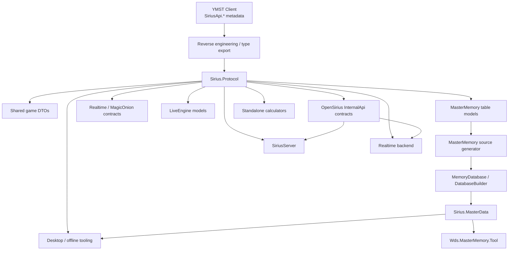

# SiriusData

<p align="center">
  <strong>Shared protocol and data infrastructure for World Dai Star: Yume no Stellarium (YMST / ユメステ)</strong>
</p>

<p align="center">
  Client-derived protocol models · MasterMemory schema/tooling · MagicOnion realtime contracts · OpenSirius internal service contracts
</p>

<p align="center">
  <a href="./README.md"><strong>English</strong></a> ·
  <a href="./README-CN.md">简体中文</a>
</p>

<p align="center">
  <a href="https://github.com/TeamOpenSirius/SiriusData/actions/workflows/dotnet.yml"></a>
  
  
  
  
</p>

---

## Overview

**SiriusData** is the shared protocol and data-model foundation used by the TeamOpenSirius ecosystem around **World Dai Star: Yume no Stellarium**.

Its primary purpose is to keep game-facing data structures in one reusable, versioned repository instead of allowing the server, realtime service, desktop tools, calculators, and other utilities to maintain incompatible private copies.

Most game-facing models in `Sirius.Protocol` were reconstructed and adapted from client-side **`SiriusApi.*`** type information exported during reverse engineering. The recovered structures were then normalized for normal .NET use, MessagePack compatibility, MasterMemory generation, and reuse across OpenSirius projects.

The repository also contains a small set of **TeamOpenSirius-specific contracts** under `Sirius.Protocol.InternalApi`. These models are private infrastructure contracts used for communication between OpenSirius services such as the game server, account/platform services, and realtime backend. They are **not** intended to represent original client APIs.

`PlatformScoreRecordMutationContracts.cs` defines the requests and replies for adding
a normally settled play and clearing one chart's play records in SiriusServer.

In short, SiriusData acts as the shared boundary between:

- reconstructed YMST client protocol structures;
- server-side implementations of those structures;
- MagicOnion realtime communication;
- MasterMemory master-data access and tooling;
- OpenSirius service-to-service contracts;
- desktop and offline tooling that needs the same data definitions.

## Goals

SiriusData is designed around a few simple rules:

- **One canonical model set** for protocol and master-data structures.
- **Wire compatibility first** — serialized shape, union IDs, field order, and type identity matter.
- **No duplicated protocol trees** across server/tool repositories.
- **Client-derived and OpenSirius-specific contracts stay distinguishable.**
- **MasterMemory uses the real source-generator pipeline**, not compatibility stubs.
- **Unknown reverse-engineered fields remain explicitly unknown** instead of being given invented semantics.
- The protocol assembly stays a **leaf dependency** that can be referenced by multiple projects.

## Repository Components

| Component | Purpose |
| --- | --- |
| `Sirius.Protocol` | Shared YMST protocol DTOs, enums, MessagePack models, MasterMemory table definitions, realtime contracts, and OpenSirius internal contracts |
| `Sirius.MasterData` | Typed MasterMemory inspection, editing, export, rebuild, and verification layer |
| `Wds.MasterMemory.Tool` | Offline CLI for unpacking, editing, translating, repacking, and validating `mastermemory.db` |

### `Sirius.Protocol`

`Sirius.Protocol` is the core assembly.

It contains the shared types used across HTTP/API-like payloads, player state, master data, live calculation, realtime communication, and related game systems.

The project currently targets:

```text
net8.0
net10.0
```

Its direct package dependencies are intentionally small:

- `MessagePack` 3.1.8
- `MessagePackAnalyzer` 3.1.8
- `MasterMemory` 3.0.4
- `MagicOnion.Abstractions` 6.1.7

### `Sirius.MasterData`

`Sirius.MasterData` builds on top of `Sirius.Protocol` and provides a typed API for working with YMST MasterMemory databases.

It handles operations such as:

- database verification;
- table discovery;
- record enumeration;
- typed add/update operations;
- JSON export;
- controlled rebuild from exported JSON;
- byte-exact no-op round-trip verification.

### `Wds.MasterMemory.Tool`

The command-line tool provides the same model-aware MasterMemory workflow for scripts and offline maintenance.

Typical use cases include:

- unpacking `mastermemory.db`;
- inspecting tables;
- exporting editable JSON;
- extracting translatable strings;
- applying localization CSVs;
- rebuilding a valid database;
- verifying schema and round-trip behavior.

## Origin of the Models

### Client-derived protocol

The majority of the game-facing protocol tree originates from client-side `SiriusApi.*` structures recovered during reverse engineering.

The current repository is **not a raw dump** of those client types. The recovered definitions have been adapted so that they can serve as a maintainable shared library:

- namespaces are organized under `Sirius.Protocol.*`;
- MessagePack contracts are preserved where required;
- MasterMemory attributes are applied to master-table models;
- incomplete/newer schema information is reconciled against observed database data where possible;
- compatibility fixes are isolated instead of being spread throughout consumer projects.

This repository should therefore be treated as a **reconstructed compatibility model of the game protocol**, not an official SDK or official source release.

### OpenSirius internal contracts

`Models/InternalApi/` is different.

These types describe TeamOpenSirius-owned service-to-service APIs, including parts of:

- realtime authentication;
- account/platform management;
- account import and takeover flows;
- player administration;
- realtime presence and revocation;
- multiplayer session coordination;
- game-master/platform operations;
- photo/platform operations.

They exist so that OpenSirius services can share strongly typed contracts without depending directly on each other's implementation projects.

They should not be interpreted as client-derived official YMST API definitions.

## Protocol Areas

### Shared game models

`Models/Shared/` contains most of the reusable game-facing data model.

It includes structures covering areas such as:

- player/profile state;
- characters and character progression;
- parties;
- music and live data;
- posters and accessories;
- items and possession data;
- missions;
- shops and currencies;
- events;
- leagues;
- photo/albums;
- gacha;
- home data;
- social and user-block state;
- other shared result/payload types.

Many of these types participate in the central MessagePack `IDataObject` union.

### `IDataObject`

`Sirius.Protocol.Shared.IDataObject` is an important compatibility boundary.

It is a MessagePack `[Union]` interface whose union members span a large part of the shared game model, including master-table and runtime/player objects.

Because master-table objects participate in this same union, the MasterMemory model layer cannot be safely split into an unrelated assembly without changing type identity and protocol dependencies.

This is why the complete shared protocol remains in `Sirius.Protocol`.

### Realtime

`Models/Realtime/` contains models and abstractions used by the realtime network layer.

The realtime side includes MagicOnion-compatible hub contracts and shared types used for features such as:

- common realtime communication;
- circle / chat functionality;
- multiplayer state;
- live-related realtime messages;
- notifications and presence.

Where required, MagicOnion-specific interfaces are kept next to the reconstructed realtime model so both the realtime server and compatible clients/tools can reference the same contract definitions.

### LiveEngine

`Models/LiveEngine/` contains models and enums used by live/scoring logic, including effect, trigger, branch-condition, and related calculation structures.

### Master data

MasterMemory table models live under:

```text
src/Sirius.Protocol/Models/Shared/Models/Master/
```

The current model set covers **229 MasterMemory tables**.

The checked-in source contains model definitions only. The following types are generated at compile time by **Cysharp MasterMemory 3.0.4**:

- `Sirius.Protocol.Shared.MemoryDatabase`
- `Sirius.Protocol.Shared.DatabaseBuilder`
- `Sirius.Protocol.Shared.ImmutableBuilder`
- `Sirius.Protocol.Shared.Tables.*Table`
- MasterMemory MessagePack resolver support

Do not add hand-written replacements for those generated classes.

## Architecture



The important design point is that **consumer projects depend on SiriusData**, rather than SiriusData depending on server implementation code.

## Project Layout

```text
SiriusData/
├── .github/
│   └── workflows/
│       └── dotnet.yml
├── SiriusData.sln
└── src/
    ├── Sirius.Protocol/
    │   ├── Common/
    │   ├── Compatibility/
    │   ├── Models/
    │   │   ├── InternalApi/
    │   │   ├── LiveEngine/
    │   │   ├── Realtime/
    │   │   ├── Root/
    │   │   └── Shared/
    │   │       └── Models/
    │   │           └── Master/
    │   ├── MasterMemoryGeneratorOptions.cs
    │   ├── README.MasterMemory.md
    │   └── tools/
    │       └── Wds.MasterMemory.Tool/
    └── Sirius.MasterData/
        ├── IO/
        └── MasterMemory/
```

## Build

### Requirements

For the full multi-target solution, use a .NET SDK capable of building both target frameworks.

```powershell
dotnet restore .\SiriusData.sln
dotnet build .\SiriusData.sln -c Release
```

The main libraries target:

```text
net8.0
net10.0
```

The offline MasterMemory tool targets .NET 8.

## Consuming SiriusData

For active development, TeamOpenSirius repositories are normally checked out side by side:

```text
workspace/
├── SiriusData/
├── SiriusServer/
└── SiriusToolbox/
```

A consuming project can reference the source directly:

```xml
<ItemGroup>
  <ProjectReference Include="..\SiriusData\src\Sirius.Protocol\Sirius.Protocol.csproj" />
</ItemGroup>
```

For environments where a sibling source checkout is not available, `Sirius.Protocol` can also be packed and consumed as a NuGet package.

### Build the package

```powershell
dotnet pack .\src\Sirius.Protocol\Sirius.Protocol.csproj `
  -c Release `
  -o .\artifacts\packages
```

The package ID is:

```text
Sirius.Protocol
```

Consumer repositories may use a conditional `ProjectReference` / `PackageReference` strategy so developer environments use live source while isolated build environments use the packed artifact.

## MasterMemory Usage

`mastermemory.db` is a MasterMemory database and should not be treated as a plain MessagePack root object.

Use the generated database type:

```csharp
using Sirius.Protocol.Shared;

byte[] bytes = await File.ReadAllBytesAsync("mastermemory.db");

var db = new MemoryDatabase(
    bytes,
    maxDegreeOfParallelism: Environment.ProcessorCount);

var music = db.MusicMasterTable.FindById(1);
```

### Typed editing API

`Sirius.MasterData` provides higher-level operations:

```csharp
var report = MasterMemoryDatabaseService.Verify(databasePath);

var tables = MasterMemoryDatabaseService.GetTables(databasePath);

var rows = MasterMemoryDatabaseService.ListRecords(
    databasePath,
    tableName,
    offset,
    limit);

await MasterMemoryDatabaseService.ExportAllJsonAsync(
    databasePath,
    jsonDirectory);

var pack = MasterMemoryDatabaseService.PackFromJson(
    sourceDatabase,
    jsonDirectory,
    baselineJsonDirectory,
    outputDatabase,
    requireExact: true);
```

The rebuild pipeline tries to preserve original table payload blocks when values are unchanged. This makes strict no-op round-trip verification useful both for binary reproducibility and as a practical schema/model correctness check.

## Wds.MasterMemory.Tool

Run the CLI help:

```powershell
dotnet run --project .\src\Sirius.Protocol\tools\Wds.MasterMemory.Tool -- --help
```

Typical workflow:

```powershell
dotnet run --project .\src\Sirius.Protocol\tools\Wds.MasterMemory.Tool -- `
  unpack .\mastermemory.db .\dump

# edit dump\tables\*.json

dotnet run --project .\src\Sirius.Protocol\tools\Wds.MasterMemory.Tool -- `
  pack .\dump .\mastermemory_modified.db

dotnet run --project .\src\Sirius.Protocol\tools\Wds.MasterMemory.Tool -- `
  verify .\mastermemory_modified.db
```

Exact no-op round trip:

```powershell
dotnet run --project .\src\Sirius.Protocol\tools\Wds.MasterMemory.Tool -- `
  roundtrip .\mastermemory.db .\rt
```

Localization workflow:

```powershell
dotnet run --project .\src\Sirius.Protocol\tools\Wds.MasterMemory.Tool -- `
  extract-text .\dump .\translation.csv

dotnet run --project .\src\Sirius.Protocol\tools\Wds.MasterMemory.Tool -- `
  apply-text .\dump .\translation.csv
```

See [`src/Sirius.Protocol/tools/Wds.MasterMemory.Tool/README.md`](./src/Sirius.Protocol/tools/Wds.MasterMemory.Tool/README.md) for tool-specific details.

## Reverse-Engineering and Schema Guidelines

Protocol work in this repository should prefer evidence over guessed semantics.

When updating client-derived models:

1. preserve known serialized field order / MessagePack keys;
2. preserve known union IDs and type identities;
3. compare against current client metadata and observed payloads;
4. verify MasterMemory changes against a real database;
5. use conservative names such as `ReservedXX` when the meaning of a recovered field is not established;
6. do not invent secondary indexes or relationships without evidence.

For MasterMemory changes, run the round-trip verification before relying on the updated schema.

## Updating the MasterMemory Schema

Changes to classes under:

```text
src/Sirius.Protocol/Models/Shared/Models/Master/
```

change the generated MasterMemory database API.

After modifying those models:

```powershell
dotnet build .\SiriusData.sln -c Release

dotnet run --project .\src\Sirius.Protocol\tools\Wds.MasterMemory.Tool -- `
  roundtrip .\mastermemory.db .\rt
```

A successful byte-exact no-op round trip is a strong signal that the model still matches the supplied database structure.

## CI

GitHub Actions runs on pushes and pull requests targeting `main`.

The workflow performs:

1. dependency restore;
2. solution build;
3. `dotnet test`.

See [`.github/workflows/dotnet.yml`](./.github/workflows/dotnet.yml).

## Contributing

Contributions that improve protocol accuracy, recover missing schema information, or make shared infrastructure easier to reuse are welcome.

When changing reconstructed protocol structures, include enough evidence to explain why the serialized shape or semantics should change.

Keep OpenSirius-only service contracts under `Sirius.Protocol.InternalApi` rather than mixing them into client-derived namespaces.

## Usage and Licensing

No repository-level `LICENSE` file is currently included. Source availability should therefore not be interpreted as granting a specific open-source license.

Third-party dependencies such as MessagePack, MasterMemory, and MagicOnion remain subject to their own licenses.

## Disclaimer

SiriusData is an unofficial community interoperability and infrastructure project.

*World Dai Star*, *World Dai Star: Yume no Stellarium*, ユメステ, and related names, data, assets, and trademarks belong to their respective rights holders. This repository is not an official SDK and is not affiliated with or endorsed by the game's developers, publishers, or operators.
